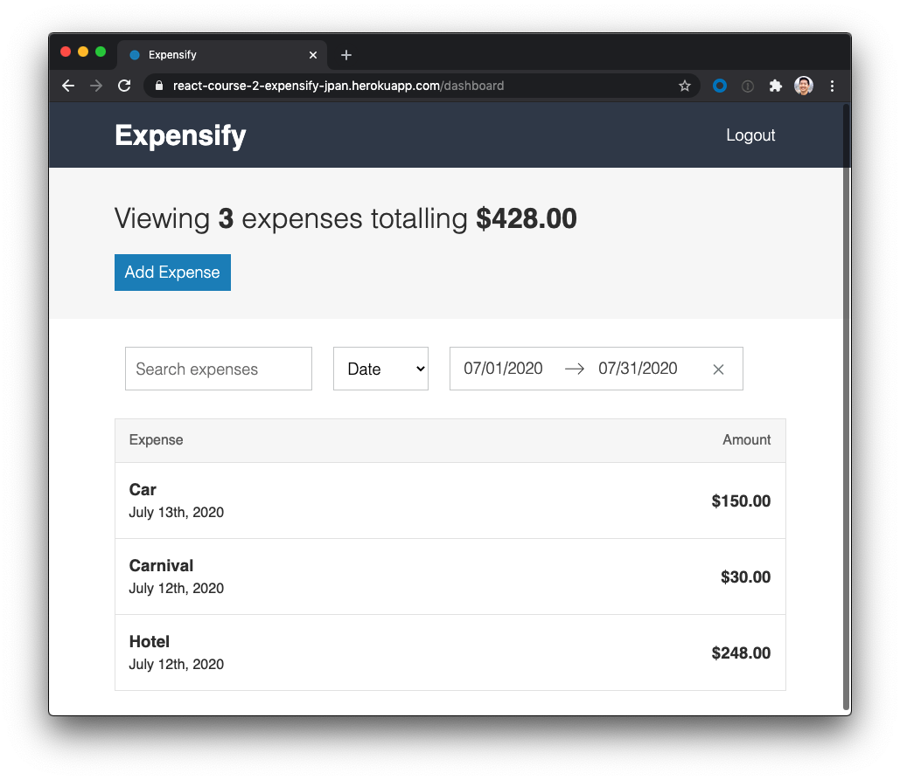
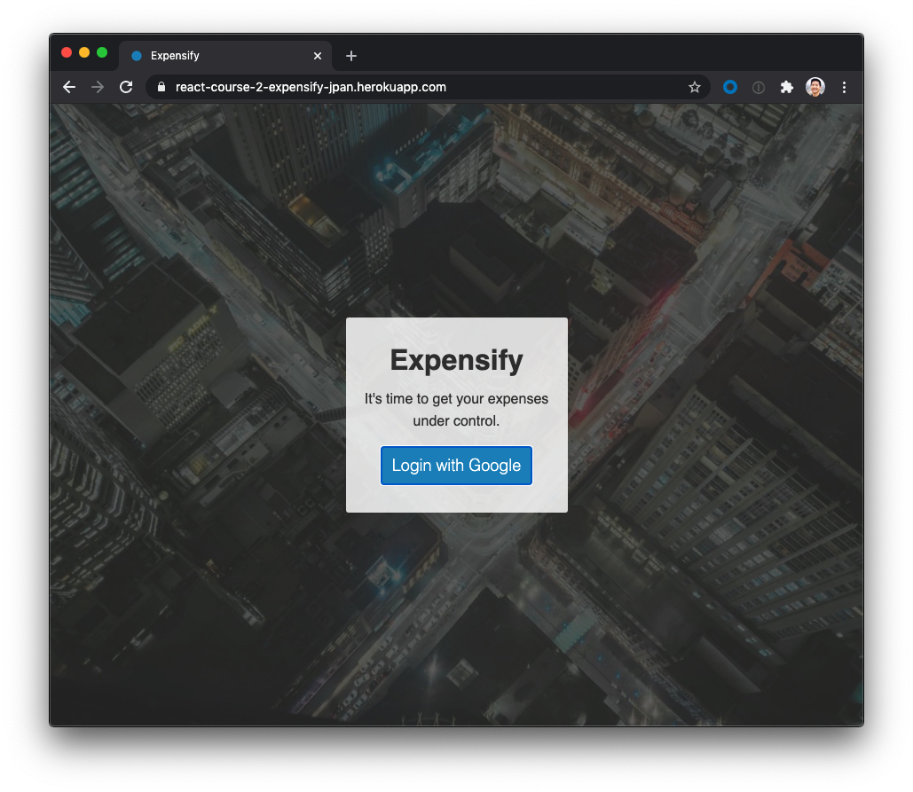

# Expensify App

Sample app for demonstrating the modern React ecosystem.

Test it at:
https://react-course-2-expensify-jpan.herokuapp.com/

## Dashboard

The dashboard is the home page of the Expensify app. From here, users can:
* Create new expenses
* Search for expenses by title
* Sort expenses by Date or Amount
* Display expenses within a specific date range

Selecting any individual expense brings up an "Edit Expense" page, where users can update or remove an expense.

## Adding Expenses

Adding an expense stores the expense to the database and updates the Redux State of the application, ultimately leading to a new expense being displayed on the screen.

## Filtering Expenses

Dispatching filter events updates the Redux State so that only matching expenses are displayed to the user.

## Backend Utilities

As a primarily frontend-focused application, the Expensify app uses a Node.JS Express App integrated with [Firebase Authentication](https://firebase.google.com/docs/auth) and [Realtime Database](https://firebase.google.com/docs/database).

The "Login with Google" button allows the user to select a current Google auth session to use with the Expensify app.

Test data is held within a second Firebase DB instance.

# This app uses...
- ES6 React with JSX
- Redux State Management
- React Router
- Webpack
- CSS Extraction
- Normalized CSS
- Testing with Jest and Enzyme
- Test database
- Async Actions with React Thunk
- Firebase DB
- Firebase Auth
- Integrating Airbnb date picker
- Production build & deployment with Heroku
- Dev build & deployment, including sourcemaps
- Public/private routes
- Backend auth and data security handled by Firebase
- Frontend auth and data security handled by React State
- Styling with SASS/SCSS/bem
- Mobile-friendly styling
- Babel polyfill for substituting unsupported array methods (use browserstack)
